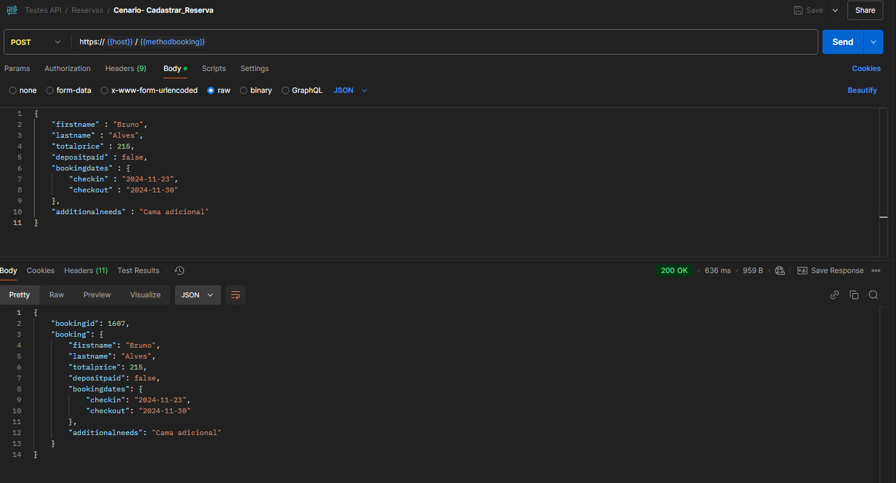
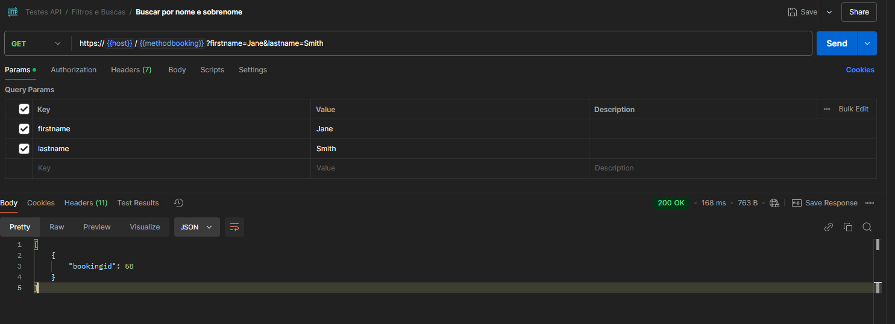

# Cenários de Testes - API

Esse arquivo tem como objetivo evidênciar os testes realizados nas apis https://restful-booker.herokuapp.com/

## 1 - Configurações criadas para os cenários
### Variáveis


### Scripts auth


## 2 - Autenticação

### Cenário 1 - Método Auth sem credenciais
- **Método:** POST
- **URL:** https://restful-booker.herokuapp.com/auth
- **Paramêtros:**

```
username: Não informar
password: Não informar
```
#### Resultado Retornado

```
- Status code: '200'
- Response body: "bad credentials"
```
#### Evidência


### Cenário 2 - Método Auth com credenciais válidas
- **Método:** POST
- **URL:** https://restful-booker.herokuapp.com/auth
- **Paramêtros:**

```sh
username: admin
password: password123
```
#### Resultado Retornado

```
- Status code: '200'
- Response body: deve retornar o token
```
#### Evidência


### Cenário 3 - Método Auth com credenciais inválidas
- **Método:** POST
- **URL:** https://restful-booker.herokuapp.com/auth
- **Paramêtros:**

```sh
username: email
password: password123
```
#### Resultado Retornado
```
- Status code: '200'
- Response body: "bad credentials"
```

#### Evidências


## 3 - Gestão de Reservas

### Cenário 1 - Consultar Todas as Reservas
- **Método:** GET
- **URL:** https://restful-booker.herokuapp.com/booking

#### Resultado Retornado

```
- Status code: '200'
- Response body: objeto contendo a lista de reservas cadastradas
```
#### Evidências


### Cenário 2 - Cadastrar Reservas
- **Método:** POST
- **URL:** https://restful-booker.herokuapp.com/booking
- **Parâmetros body**:
```
{
    "firstname" : "Bruno",
    "lastname" : "Alves",
    "totalprice" : 215,
    "depositpaid" : false,
    "bookingdates" : {
        "checkin" : "2024-11-23",
        "checkout" : "2024-11-30"
    },
    "additionalneeds" : "Cama adicional"
}
```


#### Resultado Retornado

```
- Status code: '200'
- Response body: retorno com o id da reserva criado e os dados informados
```
#### Evidências



### Cenário 3 - Consultar Reserva Específica
- **Método:** GET
- **URL:** https://restful-booker.herokuapp.com/booking/1607
- **Parâmetros**: ```1607```


#### Resultado Retornado

```
- Status code: '200'
- Response body: retorno dos dados da reserva cadastrada
```
#### Evidências


### Cenário 4 - Alterar Nome e sobrenome da Reserva
- **Método:** PATCH
- **URL:** https://restful-booker.herokuapp.com/booking/1838
- **Parâmetros**: ```1838```
- **Body**:
```
{
    "firstname" : "Jaqueline",
    "lastname" : "Alves"
}
```


#### Resultado Retornado

```
- Status code: '200'
- Response body: retorno dos dados da reserva
```
#### Evidências


### Cenário 5 - Alterar Dados da Reserva Data Inválida
- **Método:** PUT
- **URL:** https://restful-booker.herokuapp.com/booking/1838
- **Parâmetros**: ```1838```
- **Body**:
```
{
    "firstname" : "Jessica",
    "lastname" : "Alves",
    "totalprice" : 215,
    "depositpaid" : true,
    "bookingdates" : {
        "checkin" : "2024-11-15",
        "checkout" : "2024-11-31"
    }
}
```


#### Resultado Retornado

```
- Status code: '405'
```
#### Evidências


### Cenário 6 - Alterar Dados da Reserva Incompleto
- **Método:** PUT
- **URL:** https://restful-booker.herokuapp.com/booking/1838
- **Parâmetros**: ```1838```
- **Body**:
```
{
    "firstname" : "James",
    "lastname" : "Brown"
}
```


#### Resultado Retornado

```
- Status code: '400'
- Bad request
```
#### Evidências


### Cenário 7 - Alterar Dados da Reserva
- **Método:** PUT
- **URL:** https://restful-booker.herokuapp.com/booking/87
- **Parâmetros**: ```87```
- **Body**:
```
{
    "firstname" : "Patricia",
    "lastname" : "Alves",
    "totalprice" : 215,
    "depositpaid" : true,
    "bookingdates" : {
        "checkin" : "2024-11-13",
        "checkout" : "2024-11-30"
    }
}
```


#### Resultado Retornado

```
- Status code: '200'
- Response body: retorno dos dados da reserva alterada
```
#### Evidências


### Cenário 8 - Deletar Reserva
- **Método:** DELETE
- **URL:** https://restful-booker.herokuapp.com/booking/18
- **Parâmetros**: ```18```


#### Resultado Retornado

```
- Status code: '201'

```
#### Evidências


### Cenário 9 - Alterar Dados da Reserva Inexistente
- **Método:** PATCH
- **URL:** https://restful-booker.herokuapp.com/booking/18
- **Parâmetros**: ```1838```
- **Body**:
```
{
    "firstname" : "James",
    "lastname" : "Brown"
}
```


#### Resultado Retornado

```
- Status code: '405'

```
#### Evidências


### BUGS
- Result code retornado no **cenário 5** e **cenário 9** ao invés de _405_ que deve ser utilizado quando é conhecido pelo servidor, mas não é suportado pelo recurso de destino, poderia ser utilizado o _422_ e mostrar a mensagem de retorno tratada com as mensagens de negócios (data inválida/reserva não localizada,etc..).
- Result code retornado no **cenário 8** ao invés de _201_ que deve ser utilizado quando a solicitação foi bem-sucedida e um novo recurso foi criado como resultado, poderia ser utilizado o _200_ para retornar somente o sucess da operação, sem gerar dupla interpretação.


## 4 - Filtros e Buscas

### Cenário 1 - Consultar por Nome e Sobrenome
- **Método:** GET
- **URL:** https://restful-booker.herokuapp.com/booking?firstname=Jane&lastname=Smith
- **Parâmetros**: 
```
firstname: Jane
lastname: Smith
```

#### Resultado Retornado

```
- Status code: '200'
- Response body: objeto contendo os ids das reservas
```
#### Evidências



### Cenário 2 - Consultar por Nome e Sobrenome inexistente
- **Método:** GET
- **URL:** https://restful-booker.herokuapp.com/booking?firstname=Tito&lastname=Alves
- **Parâmetros**: 
```
firstname: Tito
lastname: Alves
```

#### Resultado Retornado

```
- Status code: '200'
- Response body: sem retorno de objeto
```
#### Evidências


### Cenário 3 - Consultar por Período de Reserva
- **Método:** GET
- **URL:** https://restful-booker.herokuapp.com/booking?checkin="2024-11-23"&checkout="2024-12-15"
- **Parâmetros**: 
```
checkin: "2024-11-23"
checkout: "2024-12-15"
```

#### Resultado Retornado

```
- Status code: '200'
- Response body: objeto contendo os ids das reservas
```
#### Evidências


### Cenário 4 - Consultar por Período de Reserva inexistente
- **Método:** GET
- **URL:** https://restful-booker.herokuapp.com/booking?checkin="2025-11-23"&checkout="2025-12-15"
- **Parâmetros**: 
```
checkin: "2025-11-23"
checkout: "2025-12-15"
```

#### Resultado Retornado

```
- Status code: '200'
- Response body: sem retorno de objetos
```
#### Evidências


### Cenário 5 - Consultar por Período de Reserva Inválida
- **Método:** GET
- **URL:** https://restful-booker.herokuapp.com/booking?checkin="2025-11-23"&checkout="2025-12-15"
- **Parâmetros**: 
```
checkin: "2025-11-23"
checkout: "2025-12-15"
```

#### Resultado Retornado

```
- Status code: '200'
- Response body: sem retorno de objetos
```
#### Evidências


### Cenário 6 - Consultar por Período de Reserva Data Checkout anterior a Data Checkin
- **Método:** GET
- **URL:** https://restful-booker.herokuapp.com/booking?checkin="2024-12-20"&checkout="2023-01-13"
- **Parâmetros**: 
```
checkin: "2024-12-20"
checkout: "2023-01-13"
```

#### Resultado Retornado

```
- Status code: '200'
- Response body: sem retorno de objetos
```
#### Evidências


### Cenário 6 - Consultar Reserva Inexistente
- **Método:** GET
- **URL:** https://restful-booker.herokuapp.com/booking?18
- **Parâmetros**: ```18```

#### Resultado Retornado

```
- Status code: '404'
- Response body: Not Found
```
#### Evidências


### BUGS
- Result code retornado no **cenário 5** e **cenário 6** ao invés de _200_ que deve ser utilizado quando a solicitação foi bem-sucedida, poderia ser utilizado o _422_ e mostrar a mensagem de retorno tratada com as mensagens de negócios (data inválida/reserva não localizada,etc..).
- Result code retornado no **cenário 9** ao invés de _404_ que deve ser utilizado quando a url não é reconhecida, poderia ser utilizado o _200_ sem o retorno do objeto.
